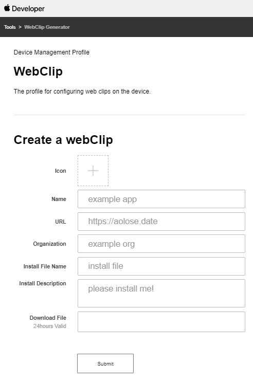

# online webClip
[Demo](https://aolose.date)



### build from source 
- `git clone https://github.com/aolose/webClip.git`
- `cd src`
- `go mod tidy`
- `go build`

### run
generate unsigned webClip file
```
./main -web=./public 
```

generate signed webClip file
```
./main -web=./public \
  -crt=/etc/letsencrypt/live/xxxx.com/cert.pem \
  -key=/etc/letsencrypt/live/xxxx.com/privkey.pem \
  -ca=/etc/letsencrypt/live/xxxx.com/chain.pem
```
open `http://127.0.0.1:7001`

### add service (ubuntu)
- edit webclip.service  
- `cp webclip.service /etc/systemd/system/webclip.service`
- `systemctl daemon-reload`
- `service webclip start`
