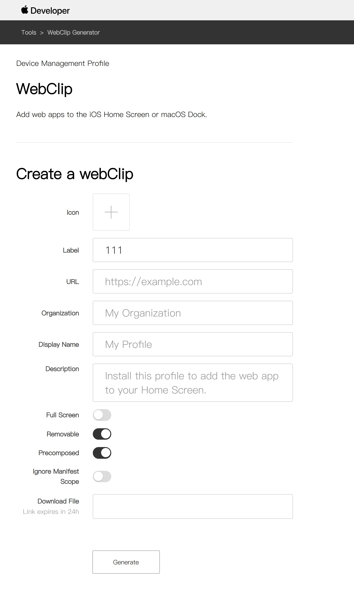

# WebClip

Generate and sign Apple WebClip configuration profiles (`.mobileconfig`) for iOS and macOS — entirely from an online web UI.

[](https://ivi.cx)



## What it does

WebClip provides a browser-based form for creating Apple MDM-style web clips. Fill in the name, URL, icon, and optional flags (fullscreen, removable, precomposed, etc.), and you get a `.mobileconfig` profile ready to install on any iOS or macOS device. When certificate paths are supplied, profiles are automatically signed with OpenSSL S/MIME for enterprise deployment.

## Features

- **Web UI** — no command-line needed for end users; fill in fields and download.
- **Unsigned profiles** — works out of the box with `./main -web=./public`.
- **Signed profiles** — provide `-crt`, `-key`, `-ca` flags to sign with OpenSSL.
- **In-memory cache** — generated profiles cached for 24 hours with automatic cleanup.
- **REST API** — create, list, download, and remove profiles programmatically.
- **GitHub release** — tag a version; CI builds and publishes a Linux binary + assets.

## Quick Start

```sh
git clone https://github.com/aolose/webClip.git
cd webClip/src
go mod tidy
go build
./main -web=../public
```

Open `http://127.0.0.1:7001` in a browser.

## Usage

### Unsigned profiles

```sh
./main -web=./public
```

### Signed profiles (OpenSSL required)

```sh
./main -web=./public \
  -crt=/path/to/server.crt \
  -key=/path/to/server.key \
  -ca=/path/to/ca.crt
```

For Caddy-managed certs:

```sh
./main -web=./public \
  -crt=/var/lib/caddy/.local/share/caddy/certificates/acme-v02.api.letsencrypt.org-directory/example.com/example.crt \
  -key=/var/lib/caddy/.local/share/caddy/certificates/acme-v02.api.letsencrypt.org-directory/example.com/example.key \
  -ca=/var/lib/caddy/.local/share/caddy/certificates/acme-v02.api.letsencrypt.org-directory/example.com/example.crt
```

### CLI flags

| Flag   | Default     | Description                |
|--------|-------------|----------------------------|
| `-web` | `../public` | Static assets directory    |
| `-crt` | `""`        | Signer certificate path    |
| `-key` | `""`        | Private key path           |
| `-ca`  | `""`        | CA certificate chain path  |

## API

All endpoints are under `/i`.

| Method | Path     | Description                     |
|--------|----------|---------------------------------|
| POST   | `/i/cfg` | Create a new webclip profile    |
| GET    | `/i/cfg` | Download a cached profile by ID |
| GET    | `/i/ls`  | List all cached profiles        |
| POST   | `/i/rm`  | Remove cached profile(s)        |

## Deploy as a systemd service (Linux)

1. Edit `webclip.service` with your paths and certificate flags.
2. Install and start:

```sh
sudo cp webclip.service /etc/systemd/system/webclip.service
sudo systemctl daemon-reload
sudo systemctl enable --now webclip
```

## Build from source

- Go 1.22+
- OpenSSL (only needed for signed profiles)

```sh
git clone https://github.com/aolose/webClip.git
cd webClip/src
go mod tidy
go build
```

## Release

Pushing a tag matching `v*` triggers the [GitHub Actions workflow](.github/workflows/release.yml), which builds a Linux amd64 binary, packages it with the public assets, and publishes a GitHub release.
